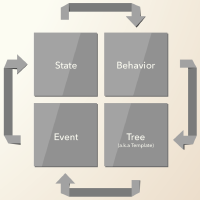

#Core Concepts

At the heart of the Famous Framework lies an architectural pattern we call BEST, which stands for behaviors, events, states, and tree. Before diving into the code, let's get familiar with the core concepts of BEST. 

## The BEST theory

User interfaces are [state machines](http://en.wikipedia.org/wiki/Finite-state_machine#Example:_a_turnstile). Visual elements depict the current state; user interactions occur, prompting the elements to transition to new states; and so on. In one sense, the _BEST_ pattern simply provides a nomenclature for this flow.

## Structure and data flow

Data in BEST modules flows in one direction. User actions (e.g. button `'clicks'` ) and programmatic events ( page load, etc. ) trigger _event_ functions, which mutate the module's internal _state_ ( the module's inner "settings" ). _Behavior_ functions then respond to these state changes and in turn update the elements in the _tree_. If you think of the _tree_ as analogous to HTML, then behaviors are a lot like CSS, but with responsive functions. 

### Behaviors

Behaviors describe how the elements in the tree should be displayed. More precisely, behaviors are _pure functions triggered by changes in state_. They can control anything from size, position and rotation, to [control flow](control-flow.md), content and CSS styling. 

Behavior functions get called every time a state value they are observing gets modified. For example, the following behavior function responds to changes in `clickCount` ( an internal state value ), reflecting a new `position` back to a `#foo` element in its scene ( tree ):

    behaviors:{	
        "#foo": {
            position: function(clickCount) {
                return Math.sin(clickCount / 1000);
            }
        }
    }
 

In other words, whenever `clickCount` changes, `#foo`'s position function will fire. 

For a deeper look at behaviors, see the [behaviors section](behaviors.md). 

### Events

Events are functions that respond to user interactions and other phenomena. Their job is to _mutate state values_ that are managed by the module to which they belong. 

It's up to the developer to define how the state mutation occurs within an event function. In this example, a `click` input event on a `surface` element has the effect of incrementing the state value `clickCount`. 

    events: {
        surface: {
            click: function($state) {
                $state.incr('clickCount');
            }
        }
    }

Notice how we dependency inject the `$state` object to access the state value: `clickCount`.

For more on events, visit the [events section](events.md).

### States

States are the _arbitrary (and serializable) values_ encapsulated by a module. You can think of them as the global "settings" for a given module. States must be isolated and cannot be shared between modules; only a module's event functions are permitted to change them. The default value for all of a module's states can be given as a simple object:

    states: {
        clickCount: 0
    }

Check out the [states section](states) for more detail.

### Tree

Trees structure an application's elements in an ordered heirarchy. They are a _declarative representation of the [Famous Scene Graph](http://famous.org/learn/scene-graph.html)_. Each module has only one tree, which is represented by XML. 

    tree: `    
    <!-- or subsitute with your structure language of choice -->
    <node id="foo">
        <node>Hi There</node>
    </node>
    `
Unlike the other modules facets (behaviors, events, states), the tree is not provided as an object, but instead as a string. Above we use ES6 [multi-line strings](https://developer.mozilla.org/en-US/docs/Web/JavaScript/Reference/template_strings) with the accent grave (`&#96;`) to define our tree (we can also do this by file reference or through a simple string). 

Visit the [trees section](trees.md) for a deeper look. 

### Components

Together, the behaviors, events, states, and tree define a single Framework component (not to be confused with an [Engine Component](http://famous.org/learn/components.html)). We describe Framework projects as components because each project can be easily reused and incorporated into other projects almost like a child's LEGO block. 

See the [reusable component section](reusable-components.md) for more on Framework components.

## Benefits of BEST

### Isolated statefulness

Even simple interfaces can depend on a lot of state manipulation. Add user interactions, input fields, and remote data-loading to the mix, and statefulness can balloon; scattered state can be particularly difficult to debug. With BEST, every module's state is entirely encapsulated, and can only be mutated in one place: event functions. This enclosure makes it much more obvious where and when state has changed, and what the precise effects of each change are.

### Strict messaging interface

Since state in BEST cannot be shared between modules, event functions become the only conduit for one module to affect the internal state of another. BEST strictly enforces the important idea of [message passing](http://en.wikipedia.org/wiki/Object-oriented_programming#Dynamic_dispatch.2Fmessage_passing) from object-oriented programming: Developers must think carefully about the interface they want their module to expose, and it should be the responsibility of the module, not external code, to decide how to change.

### Declarative composition

Because BEST is an architectural pattern for scene-graph applications (for example, [Famous](http://famous.org)), and since every BEST module's scene graph is described by a declarative tree, composing and extending scenes is as easy as copying and pasting a line of code. Consider this snippet, in which a developer has placed a carousel, a video, and an accordion list into three-column layout. Any of these components could be trivially replaced by another one.

    <layout-3-col>
        <col> <carousel> ... </carousel> </col>
        <col> <video> ... </video> </col>
        <col> <accordion> ... </accordion> </col>
    </layout-3-col>

### Pure effects

Behaviors functions are pure functions: They have no observable side-effects, and they must always return the same result for the same argument values. The upshot is that, for any given snapshot of the state values, the rendered scene will always look precisely the same. In applications that manage time, such as [Famous](http://famous.org), frame-by-frame replayability becomes possible.

