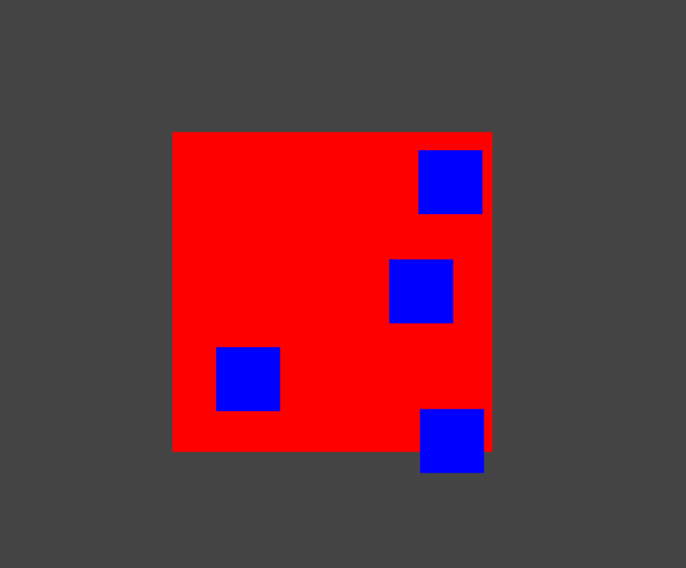

Now that our scene is created in `apple-tv.html` we have a structure where we can attach behaviors. In this section we will build out our main component file `apple-tv.js` and add a _module facet_ for behaviors.

##  The Framework component
                    
Below, we dissect an empty framework component. Note how we already included a reference to the tree we built in the last section: `apple-tv.html`.  This will import our tree into the Framework component.
     
                             //    ↓ path to your project
    FamousFramework.component('famous-demos:apple-tv', {
	    behaviors: {},          // ← all of our behaviors go here
	    events: {},              // ← all of our events go here 
	    states: {},               // ← our states will go here
	    tree: 'apple-tv.html'  // ← we reference our tree here
	})
	
As you follow along, we will fill out the other module _facets_: `behaviors`, `events`, and `states`. Instead of including the entire component in every snippet, we will simply list the facet objects (sometimes only part of them) for brevity. 

Include the snippet above in `apple-tv.js` file so you can start building out your project. 

## Adding Behaviors

Let's add some behaviors to our tree so we can visualize what we created in the last section. Replace the behaviors in the snippet above with the behaviors object below. 

	behaviors: {
	    '#rotator-node': {
	        'size': [500, 500],          // 500px by 500 px
	        'align': [0.5,0.5],          //center align to window
	        'mount-point':[0.5,0.5],     // center self 
	        'style': {
	            'background': 'red'
	        }
	    },
	    '.gallery-item':{
	        'size': [100,100],   // 100px by 100px
	        'style':{
	            'background-color': 'blue'
	        },
	        '$repeat':function(){
	            return [1,2,3,4]   //repeat over array
	        },
	       'position': function($index){  // call this for each item   
	            return [Math.random()*500, Math.random()*500]
	        }
	    }
	}
	
Within behaviors, we use CSS-like selectors to target the nodes in our tree. Focus on the `$repeat` control flow statement above. A new node is created for each item in the array it returns (`[1,2,3,4]` or four nodes in total ). Then, by adding `$index` to any behavior function, we tell the framework to call that function for each item in that array. 

The code above should position 4 nodes randomly within the `#rotator-node`. If you were to remove the `$index` from the behavior function, you'd find your four nodes randomly positioned, but stacked on top of each other.

In the next section, we will add some stateful values that we can use to drive our behaviors and eventually create our animations. 

[Up next: Adding state &raquo;](./adding-state.md)

