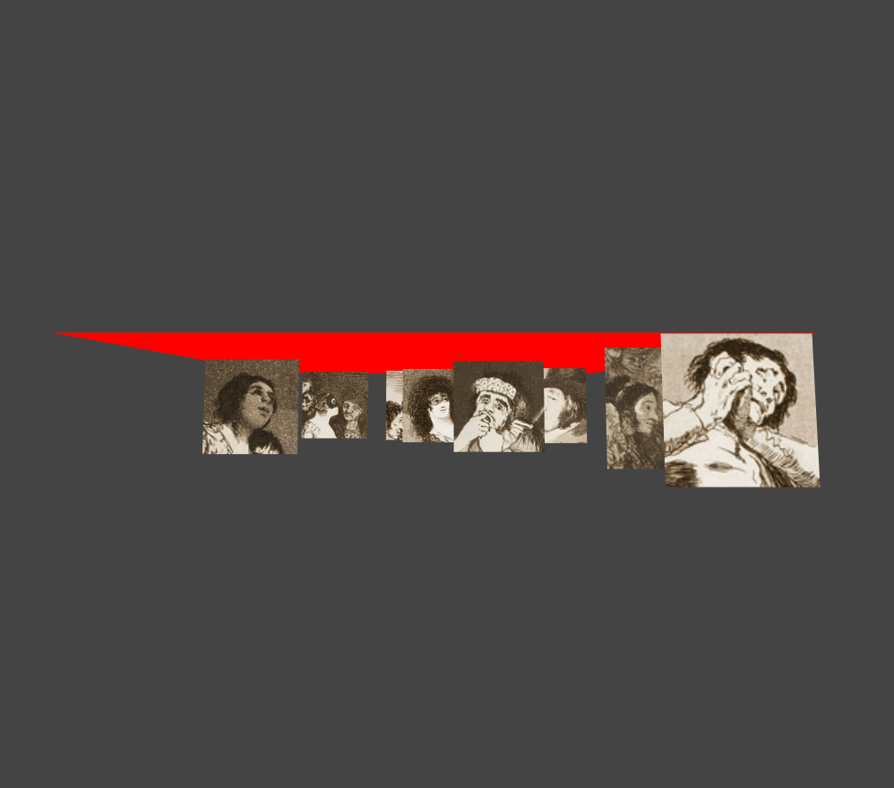

Right now the blue squares are pretty boring. Let's spice some things up by adding some Spanish modernist images to our scene. 

## The image data 

We'll first need to import the source paths for our images. We can pretend we are grabbing this data from the **Fracsicsco de Goya API** that serves up this nicely formatted array of image paths of his **Los Caprichos** etchings.

Open up the `galleryData.js` file you created earlier and paste the code snippet below into it. 

	var imageData = [
	    'http://demo.famo.us.s3.amazonaws.com/hub/apps/carousel/Museo_del_Prado_-_Goya_-_Caprichos_-_No._01_-_Autorretrato._Francisco_Goya_y_Lucientes2C_pintor_thumb.jpg',
	    'http://demo.famo.us.s3.amazonaws.com/hub/apps/carousel/Museo_del_Prado_-_Goya_-_Caprichos_-_No._02_-_El_si_pronuncian_y_la_mano_alargan_al_primero_que_llega_thumb.jpg',
	    'http://demo.famo.us.s3.amazonaws.com/hub/apps/carousel/Museo_del_Prado_-_Goya_-_Caprichos_-_No._03_-_Que_viene_el_Coco_thumb.jpg',
	    'http://demo.famo.us.s3.amazonaws.com/hub/apps/carousel/Museo_del_Prado_-_Goya_-_Caprichos_-_No._04_-_El_de_la_rollona_thumb.jpg',
	    'http://demo.famo.us.s3.amazonaws.com/hub/apps/carousel/Museo_del_Prado_-_Goya_-_Caprichos_-_No._05_-_Tal_para_qual_thumb.jpg',
	    'http://demo.famo.us.s3.amazonaws.com/hub/apps/carousel/Museo_del_Prado_-_Goya_-_Caprichos_-_No._06_-_Nadie_se_conoce_thumb.jpg',
	    'http://demo.famo.us.s3.amazonaws.com/hub/apps/carousel/Museo_del_Prado_-_Goya_-_Caprichos_-_No._07_-_Ni_asi_la_distingue_thumb.jpg',
	    'http://demo.famo.us.s3.amazonaws.com/hub/apps/carousel/Museo_del_Prado_-_Goya_-_Caprichos_-_No._09_-_Tantalo_thumb.jpg'
    ]

_Note that this is just a pretend API. If we were working with a real API we would need to wait for our API call to return before creating our image nodes._

## Importing external files

To import the `galleryData.js` file into our component, we will use the Framework component's `.config()` method. This method preloads any JavaScript or CSS files passed to it in the `includes` array.

    FamousFramework.scene('module name', {
    
       //... behaviors, events, state, tree not shown ../
       
     }).config({
         includes: [
             'galleryData.js'
         ]
    });

Note the syntax above. The `galleryData.js` file is loaded before our component, so the `imageData` array is now accessible to our application. 

Within your state object replace the empty `srcs` array with a reference to image data:

	 states: {
		      rotationValue: 0,  
		      srcs: imageData, // add your image data array   
		      contextSize: 500, 
		      positionZ:[]        
        } 

## Los im&aacute;genes

Now it's time to include our Spanish images! To do this, we will use the `content` behavior to insert the images as HTML into our `.gallery-item`: 
 
Add the following parameter to the `.gallery-item` in your behaviors object:
    
    '.gallery-item': {
         
         //.. other behaviors not shown ..//   
        
        'content': function($index, srcs){
             return  ``
        }
     
     }

In the spirit of building futuristic UI's, the framework supports modules written in ES6, so above we can use ES6 style string interpolation to embed our image paths. ( Read more about [template strings here](https://developer.mozilla.org/en-US/docs/Web/JavaScript/Reference/template_strings) ). But, don't worry ES5 loyalists! You can also use plain old string concatenation for this as well i.e. `''`
	
If you save and refresh it should look like the screenshot below:

[Up next: Positioning images &raquo;](./positioning-images.md)

